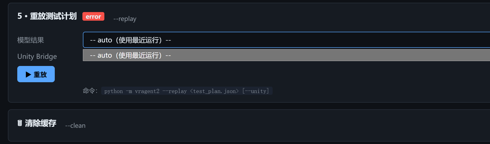
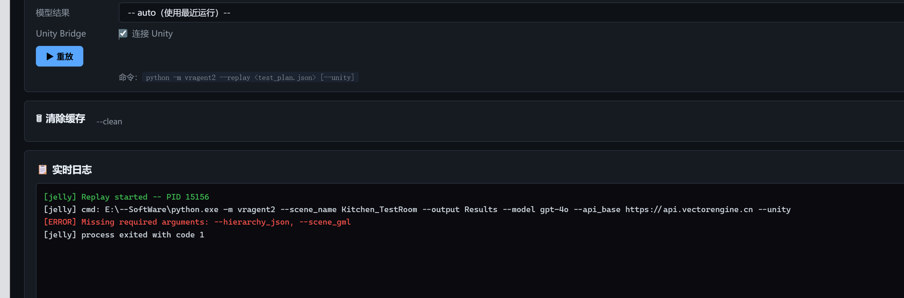

# Kitchen_TestRoom 完整上手 README

这份 README 给第一次接手这个仓库的同学。
目标不是只教你写一个 Kitchen JSON，而是让你从 clone 仓库开始，一路走到下面任意一个结果：

- 能把仓库拉下来并在新机器上跑通 Python 环境。
- 能打开 Unity 工程并找到 Kitchen_TestRoom 场景。
- 能启动 Jelly 本地服务，知道浏览器端口和 Unity Bridge 端口分别是什么。
- 知道 Jelly 里每一个目录字段应该怎么填。
- 能回放现有的 `test_plan.json`。
- 能按当前仓库的格式，手工写出一个可 replay 的最小 plan。

如果你只想马上回放 Kitchen 的现成计划，直接跳到“6. 最常用的两条工作流”。

## 1. 先认清仓库里哪一部分是干什么的

| 路径 | 作用 | 你什么时候会用到 |
|------|------|------------------|
| `TP_Generation/` | Python 侧分析、生成、Jelly 面板、Results 输出 | 跑分析、启动 Jelly、做在线/离线 pipeline |
| `VRAgent/` | Unity 工程 | 在 Unity Hub 里打开它，导入/回放 test plan |
| `TP_Generation/Results/Kitchen_TestRoom/` | Kitchen 当前结果目录 | 看现成 test plan、放新的 Kitchen 结果 |
| [VRAgent/Assets/Package/Documentation.md](../../../VRAgent/Assets/Package/Documentation.md) | 官方包文档 | 查 action 格式、Unity 侧导入流程 |
| [TP_Generation/README.md](../../README.md) | Python 环境说明 | 新机器第一次装环境 |
| [TP_Generation/Guide.md](../../Guide.md) | vragent2 完整 CLI 指南 | 需要命令行跑在线/离线流程 |
| [_doc/xrplayer/XRPlayer_Jelly_UI.md](../../../_doc/xrplayer/XRPlayer_Jelly_UI.md) | Jelly 仪表盘说明 | 想知道 2000 端口、API、界面结构 |

## 2. 从 clone 到第一次启动

### 2.1 clone 仓库

```powershell
git clone https://github.com/HenryLab-XR/VRAgent.git
cd VRAgent
```

### 2.2 建立 Python 环境

这个仓库当前推荐 Python `3.8.x`。第一次在新机器上执行：

```powershell
py -3.8 -m venv .venv
.\.venv\Scripts\activate
python -m pip install --upgrade pip
python -m pip install -r requirements.txt
python TP_Generation\check_env.py
```

如果你还要跑测试依赖，再执行：

```powershell
python -m pip install -r TP_Generation\requirements-dev.txt
python TP_Generation\check_env.py --dev
```

以后每次新开终端，只需要：

```powershell
cd <repo-root>
.\.venv\Scripts\activate
```

### 2.3 打开 Unity 工程

在 Unity Hub 里打开下面这个目录：

```text
<repo-root>\VRAgent
```

推荐 Unity 版本见官方文档：[Documentation.md](../../../VRAgent/Assets/Package/Documentation.md)。当前仓库文档写的是 `2021.3.45f1c2`。

如果你打开的是仓库自带的 Unity 工程，通常直接加载即可。
如果你不是打开这个现成工程，而是想把 VRAgent 接到一个新的 Unity 工程里，再按 [Documentation.md](../../../VRAgent/Assets/Package/Documentation.md) 里的步骤去加包、拖 Prefab、Bake NavMesh。

### 2.4 打开 Kitchen 场景

Kitchen 示例场景在：

```text
<repo-root>\VRAgent\Assets\SampleScene\Kitchen_TestRoom\Kitchen_TestRoom.unity
```

如果你的目标只是回放已有 Kitchen plan，通常不需要重新做 NavMesh 和 Prefab 拖拽；样例场景已经准备好了。

## 3. 两个端口一定不要混

这是最容易搞混的地方。

| 名称 | 默认值 | 作用 | 什么时候需要 |
|------|--------|------|--------------|
| Jelly Web 端口 | `127.0.0.1:2000` | 浏览器里的本地仪表盘 | 你想用 Jelly 界面看流程、点按钮跑 pipeline、做 replay |
| Unity Bridge TCP 端口 | `127.0.0.1:6400` | Python 和 Unity Play Mode 的在线桥接 | 你要跑 `--unity` 在线执行，或者在 Jelly 里勾选 Unity Bridge |

一句话记忆：

- `2000` 是给浏览器看的。
- `6400` 是给 Python 和 Unity 通信用的。

## 4. Jelly 服务怎么启动、怎么关闭

### 4.1 最推荐的启动方式

在仓库根目录激活 `.venv` 后，进入 `TP_Generation`：

```powershell
cd <repo-root>\TP_Generation
.\start_jelly.ps1
```

默认会：

- 自动优先使用 `<repo-root>\.venv\Scripts\python.exe`
- 在后台启动 Jelly
- 把 PID 记录到 `.jelly.pid`
- 把日志写到 `.jelly.log`
- 打开本地服务 `http://127.0.0.1:2000/`

### 4.2 手动启动方式

如果你不想用脚本，也可以手动启动：

```powershell
cd <repo-root>\TP_Generation
python -m xrplayer.jelly --port 2000 --results-dir Results
```

兼容旧入口：

```powershell
python -m vragent2.jelly --port 2000 --results-dir Results
```

### 4.3 关闭 Jelly

```powershell
cd <repo-root>\TP_Generation
.\stop_jelly.ps1
```

### 4.4 检查 Jelly 是否还活着

```powershell
cd <repo-root>\TP_Generation
.\xrplayer\jelly\check_jelly.ps1
```

如果浏览器访问不了 `http://127.0.0.1:2000/`，优先检查是不是 2000 端口已经被别的进程占用了。

## 5. Jelly 里每个目录应该怎么填

### 5.1 先说一个总规则

Jelly 里很多路径分成两类：

- 绝对路径：例如 `Assets 路径`、`Python 路径`、`Work Dir`
- 相对工作目录的路径：例如 `结果目录`、`输出目录`

只要你记住“相对路径是相对 `Work Dir` 解释的”，后面基本不会填错。

### 5.2 Add Project 弹窗怎么填

第一次打开 Jelly，先点 `+ Add` 注册项目。

推荐填写如下：

| 字段 | 推荐值 | 解释 |
|------|--------|------|
| `Name` | `VRAgentLocal` 或你自己喜欢的名字 | 只是 Jelly 里的项目标识 |
| `Assets 路径` | `<repo-root>\VRAgent\Assets` | Unity 工程的 `Assets` 目录，用来扫描 `.unity` 场景 |
| `Python 路径` | 留空，或 `<repo-root>\.venv\Scripts\python.exe` | 留空时 Jelly 会优先用本仓库 `.venv` |
| `工作目录` | 留空，或 `<repo-root>\TP_Generation` | 留空时默认就是 `TP_Generation` |
| `默认模型` | `gpt-4o` | 跑 LLM 流程时的默认模型 |
| `结果目录` | `Results` | 相对 `工作目录` 的结果根目录 |

补充说明：

- [TP_Generation/README.md](../../README.md) 里已经写了，Jelly 支持 `{repo}`、`{repo_root}`、`{tp_generation}` 这几个路径占位符。
- 如果你只是第一次上手，完全可以不碰这些占位符，按上表填就够了。

### 5.3 Workflow 页面里的字段怎么填

选中注册好的 Project 之后，再选 Scene。Kitchen 这里通常选 `Kitchen_TestRoom`。

常见字段对应关系如下：

| 字段 | Kitchen 推荐值 | 解释 |
|------|----------------|------|
| `Project` | 你刚注册的项目 | Jelly 保存的项目配置 |
| `Scene` | `Kitchen_TestRoom` | 下拉框里扫出来的 `.unity` 场景 |
| `项目根目录` | `<repo-root>\VRAgent` | 含 `ProjectSettings/` 的 Unity 工程根目录，不是 `Assets` |
| `结果目录` | `Results/Kitchen_TestRoom` | Step 1/2/3 的共同结果目录，建议每个场景一个目录 |
| `场景名称` | `Kitchen_TestRoom` | 可自动填充，也可手填 |
| `输出目录` | `Results/Kitchen_TestRoom/gpt-4o` | Step 4 的 vragent2 输出目录，建议按模型或实验名再分一层 |
| `层级 JSON` | Step 2 后自动填 | 通常就是 `Kitchen_TestRoom_gobj_hierarchy.json` |
| `依赖图 GML` | Step 1 后自动填 | Kitchen 场景对应的 `.unity.json_graph.gml` |
| `Unity Host` | `127.0.0.1` | Unity Bridge 的地址 |
| `Unity Port` | `6400` | Unity Bridge 的端口 |

几个最容易填错的点：

1. `Assets 路径` 和 `项目根目录` 不是一回事。前者是 `<repo-root>\VRAgent\Assets`，后者是 `<repo-root>\VRAgent`。
2. `结果目录` 和 `输出目录` 通常都写相对路径，不要手滑写到别的盘符绝对路径上。
3. 如果只做回放，不一定要先跑完整的 Step 1/2/3/4。

## 6. 最常用的两条工作流

### 工作流 A：我只想回放一个现成的 Kitchen plan

这是最适合新同学先跑通的一条路。

#### A1. Unity 侧直接导入回放

1. 打开 Kitchen 场景。
2. 打开 Unity 菜单：`Tools -> VR Explorer -> Import Test Plan`。
3. 在 `Test Plan Path` 里选择：

```text
<repo-root>\TP_Generation\Results\Kitchen_TestRoom\gold-manual-kitchen-v1\test_plan.json
```

4. 点击 `Import Test Plan`。
5. 检查场景里是否生成了 `FileIdManager`，并观察日志。

对应的 Unity 窗口代码在 [TestPlanImporterWindow.cs](../../../VRAgent/Assets/Package/Editor/TestPlanImporterWindow.cs)。

#### A2. 如果你想在 Jelly 里点按钮 replay

1. 启动 Jelly。
2. 进入 Workflow 页的 `5 · 重放测试计划`。
3. 在 `模型结果` 下拉框里选：`Kitchen_TestRoom/gold-manual-kitchen-v1`。
4. 如果你要走在线 replay，勾选 `连接 Unity`，并保证 Unity 端已经处于 Play Mode 且 6400 可连。
5. 点击 `重放`。

回放入口示意：



实时日志示意：



### 工作流 B：我想从 Jelly 跑完整 XRPlayer / vragent2 流程

这是做分析、生成和在线探索时走的流程。

#### B1. Step 1：场景依赖提取

- `项目根目录` 填 `<repo-root>\VRAgent`
- `结果目录` 填 `Results/Kitchen_TestRoom`
- `场景名称` 填 `Kitchen_TestRoom`
- 点击 `1 · 场景依赖提取`

#### B2. Step 2：层级遍历

- 沿用同一个 `结果目录`
- 点击 `2 · 层级遍历`
- 生成 `Kitchen_TestRoom_gobj_hierarchy.json`

#### B3. Step 3：逻辑预处理

- 可选，但建议跑
- `应用名称` 可以填 `Kitchen`、`EscapeGameVR` 或你们实验名

#### B4. Step 4：探索运行

如果是离线模式：

- 不勾选 `Unity Bridge`
- 只跑 Planner / Verifier / Observer / dry-run Executor

如果是在线模式：

- Unity 必须在 Play Mode
- 勾选 `Unity Bridge`
- Host=`127.0.0.1`
- Port=`6400`

#### B5. Step 5：重放生成结果

完成之后，Jelly 会从 `Results/<scene>/<model>/test_plan.json` 这种目录结构里自动发现可 replay 的结果。

如果你更习惯命令行，完整命令参考 [Guide.md](../../Guide.md)。

## 7. 一共有几类操作，要参考哪个文档

这里一定要分开说，因为“官方文档”和“当前代码”不完全一致。

### 7.1 按官方文档写，先看 4 类

[Documentation.md](../../../VRAgent/Assets/Package/Documentation.md) 正式讲了 4 类 action：

1. `Grab`
2. `Trigger`
3. `Transform`
4. `Socket`

如果你是在教新同学、写基础手册、或者手工写一个稳定可 replay 的 JSON，优先参考这 4 类就够了。

### 7.2 按当前代码运行，实际上支持 5 类

当前运行时代码在下面这些文件里额外支持了 `Move`：

- [ActionDef.cs](../../../VRAgent/Assets/Package/VRAgent/JSON/ActionDef.cs)
- [ActionUnitConverter.cs](../../../VRAgent/Assets/Package/VRAgent/JSON/ActionUnitConverter.cs)
- [VRAgent.cs](../../../VRAgent/Assets/Package/VRAgent/VRAgent.cs)

也就是说，代码层面当前支持：

1. `Grab`
2. `Trigger`
3. `Transform`
4. `Move`
5. `Socket`

但因为 `Move` 还没有被 [Documentation.md](../../../VRAgent/Assets/Package/Documentation.md) 正式写成面对用户的规范，所以给新同学的建议是：

- 先按 4 类官方文档上手。
- 只有在你明确看过代码或已有示例时，再使用 `Move`。

## 8. 手工写 test plan 时必须记住的规则

### 8.1 顶层结构必须长这样

ReplayGUI / Importer 读的是顶层 `taskUnits`，不是别的自定义包裹结构：

```json
{
  "taskUnits": [
    {
      "actionUnits": [
        {
          "type": "Trigger",
          "source_object_name": "DoorNode_A_Lobby",
          "source_object_fileID": "<gameobject_fileid>",
          "triggerring_time": 0.2,
          "triggerring_events": [
            {
              "methodCallUnits": [
                {
                  "script_fileID": "<script_fileid>",
                  "method_name": "Open",
                  "parameter_fileID": []
                }
              ]
            }
          ],
          "triggerred_events": []
        }
      ]
    }
  ]
}
```

### 8.2 当前仓库实践里，FileID 统一写字符串

虽然包文档里很多地方把 FileID 说明成 `long`，但当前仓库代码里的反序列化字段实际就是字符串：

- [ActionDef.cs](../../../VRAgent/Assets/Package/VRAgent/JSON/ActionDef.cs)
- [TaskDef.cs](../../../VRAgent/Assets/Package/VRAgent/JSON/TaskDef.cs)

所以在这个仓库里，建议把下面这些字段都写成字符串：

- `source_object_fileID`
- `target_object_fileID`
- `script_fileID`
- `parameter_fileID` 里的元素（虽然当前必须为空）

### 8.3 `parameter_fileID` 现在必须是空数组

当前版本不支持真正的参数绑定，所以统一写：

```json
"parameter_fileID": []
```

### 8.4 方法必须满足当前绑定约束

对 `Trigger` / `Transform` 的 event 调用来说，优先使用：

- `public`
- 实例方法
- 无参数方法
- 所在类继承自 `MonoBehaviour`

### 8.5 GameObject 和组件 FileID 怎么抄

在 Unity 里：

1. 打开 `Tools -> VR Explorer -> Import Test Plan`
2. 在 `Select Object` 里选对象或脚本组件
3. 点击 `Print Object FileID`
4. Console 会打印并自动复制到剪贴板

这个按钮逻辑在 [TestPlanImporterWindow.cs](../../../VRAgent/Assets/Package/Editor/TestPlanImporterWindow.cs) 里已经写死了。

### 8.6 prefab instance 的 FileID 不要乱抄

这是 Kitchen 里最容易出问题的一点。

规则是：

1. 不要优先抄 scene YAML 里的 `PrefabInstance` 根 ID。
2. 优先使用 Unity Importer 当前打印出来的 FileID。
3. 如果某个 runtime FileID 已经在 replay 里验证成功，优先复用那个值。

否则很容易出现：

- `Source object not found`
- `Component with script FileID not found`

## 9. Kitchen 已验证的写法和注意事项

### 9.1 先区分你写的是哪种计划

| 类型 | 目标 | 允许的写法 | 不该默认带入的规则 |
|------|------|------------|--------------------|
| `Utility plan` | 只验证一个局部效果，例如“把某扇门打开” | 可以直接调用 `Unlock()`、`Open()` 这类局部方法 | 不要默认强行带入完整 RecipeController 主线 |
| `Workflow plan` | 验证真实任务链，例如做菜、交付、通关 | 优先走真实交互链：拿物体、插 socket、触发按钮、等待计时 | 不要用 direct unlock / direct setter 随便跳步骤 |

之前最容易犯的错，就是把一个局部开门 plan 错写成完整任务链 plan。

### 9.2 `Grab` 只是搬运，不默认等于业务逻辑触发

当前导入器 replay 时会临时加 `XRGrabbable` 去执行搬运，所以 `Grab` 更接近“把物体移过去”，不保证一定命中你自定义脚本里的业务逻辑。

所以：

- 如果你的目标只是“把钥匙搬到门口”，`Grab` 可以用。
- 如果你的目标是“必须触发某个自定义 `OnGrabbed()` 或任务状态推进”，不要想当然地只写 `Grab`，而要检查是否需要 `Trigger`。

### 9.3 Kitchen 已验证样例

当前已验证的手工样例在 [gold-manual-kitchen-v1/test_plan.json](gold-manual-kitchen-v1/test_plan.json)。

其中已经验证成功的关键 ID 是：

- `DoorNode_B_Pantry` GameObject FileID：`4044343917557724018`
- `DoorController` 组件 FileID：`4570469118789352246`

可复用的局部模式是：

1. 先 `Open` A 房间门
2. `Grab Key_Pantry` 到 `DoorNode_B_Pantry`
3. 对 `DoorNode_B_Pantry` 触发 `Unlock` 再 `Open`

这适合“局部开门验证”，不等于 Kitchen 完整 happy path。

## 10. 常见报错怎么查

| 现象 | 优先怀疑什么 |
|------|--------------|
| `http://127.0.0.1:2000/` 打不开 | Jelly 没启动，或者 2000 端口被占用 |
| `Cannot connect to Unity` / `connection refused` | Unity 没进 Play Mode，或者 6400 端口不通 |
| `Source object not found` | `source_object_fileID` 写错，常见于 prefab instance |
| `Component with script FileID not found` | `script_fileID` 写错 |
| `No parameterless method` | `method_name` 绑定的方法不是 public 无参实例方法 |
| Jelly 里结果目录一直扫描不到 | `结果目录` / `输出目录` 相对 `Work Dir` 填错了 |

如果是 Unity Bridge 连不上，优先检查这 4 件事：

1. Unity 是否在 Play Mode
2. 场景里是否有在线桥组件
3. Jelly / CLI 里填的端口是不是 `6400`
4. 本机防火墙是否拦了 `127.0.0.1:6400`

## 11. 建议你继续看的文档

- 仓库总览：[README.md](../../../README.md)
- Python 环境与 Jelly 说明：[TP_Generation/README.md](../../README.md)
- vragent2 命令行完整指南：[TP_Generation/Guide.md](../../Guide.md)
- Jelly UI 说明：[_doc/xrplayer/XRPlayer_Jelly_UI.md](../../../_doc/xrplayer/XRPlayer_Jelly_UI.md)
- Unity 包官方说明：[VRAgent/Assets/Package/Documentation.md](../../../VRAgent/Assets/Package/Documentation.md)
- Kitchen 场景补充说明：[VRAgent/Assets/SampleScene/Kitchen_TestRoom/DELIVERY_NOTES.md](../../../VRAgent/Assets/SampleScene/Kitchen_TestRoom/DELIVERY_NOTES.md)
- Kitchen 测试命令补充：[VRAgent/Assets/SampleScene/Kitchen_TestRoom/TESTING_COMMANDS.md](../../../VRAgent/Assets/SampleScene/Kitchen_TestRoom/TESTING_COMMANDS.md)

如果你只给另一个同学交接一件事，那就让他先按这份 README 跑通“工作流 A”，先把现成 plan replay 成功，再去写新的 JSON。
